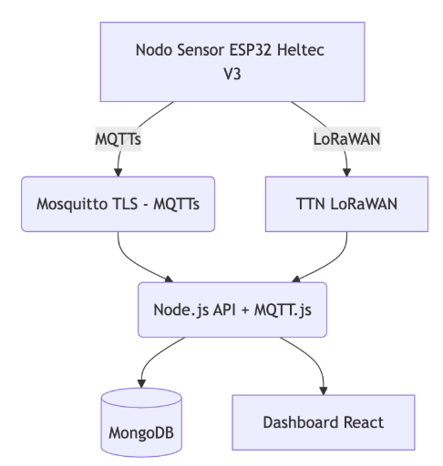

# 🌎 Sistema de Monitoreo de Calidad del Aire (SMCA) – Versión 0.1

**Autor:** Ing. Rodrigo J. Pinedo Nava  
**Carrera:** Especialización en Internet de las Cosas  
**Institución:** Facultad de Ingeniería – Universidad de Buenos Aires (FIUBA)  
**Fecha:** Abril 2025

---

## 🎯 Objetivo General

Desarrollar un sistema IoT completo para el monitoreo ambiental distribuido, orientado a medir y visualizar parámetros clave de calidad del aire en zonas urbanas, utilizando nodos sensores ESP32 conectados vía WiFi y LoRaWAN.

---

## 🏗️ Arquitectura del Sistema



## 🧰 Tecnologías Utilizadas
- 🛠️ Hardware: ESP32 Heltec V3 (ESP-IDF en C)
- 📡 Transporte: MQTT con TLS mutuo (Mosquitto Broker)
- 🧠 Backend: Node.js, Express, MQTT.js, Mongoose
- 🗄️ Base de datos: MongoDB
- 🖥️ Frontend: React + Vite + MaterializeCSS
- 🐳 Infraestructura: Docker + Docker Compose
- 🌐 Red LoRaWAN: TTN (The Things Network)

## 📂 Estructura de Carpetas

``` bash
IoT_Sistema_monitoreo_calidad_aire/
├── backend/          # API Node.js + MQTT + MongoDB
├── frontend/         # Dashboard web en React
├── database/         # Base de datos Mongo
├── hardware/         # Firmware para ESP32 (ESP-IDF)
├── mqtt/             # Broker Mosquitto con TLS mutuo
├── docker/           # Configuración Docker, TLS, Mosquitto, Mongo
├── docs/             # Documentación del proyecto
└── README.md         # Este archivo
```

## 🖼️ Vistas del Sistema

| Vista                    | Descripción                                                 |
| ------------------------ | ----------------------------------------------------------- |
| `/dashboard`             | Estado global, mapa de nodos activos, semáforo AQI por zona |
| `/dispositivo/:sensorId` | Últimas lecturas y gráficos por sensor                      |
| `/zona/:zonaId`          | AQI medio por zona, comparativas históricas                 |
| `/historico`             | Filtros por sensor/zona/fecha + exportación CSV/Excel       |
| `/admin`                 | Gestión de nodos, umbrales de alerta, logs del sistema      |
| `/public`                | Vista pública simplificada con AQI y mapa sin autenticación |


## 🔐 Seguridad TLS
- Broker MQTT Mosquitto configurado con autenticación mutua TLS (certificados CA, cliente y servidor).
- Certificados generados en docker/certs/.
- El ESP32 debe embebir ca_cert.pem, client_cert.pem y client_key.pem.

## 📡 Detalles MQTT
- Broker: Mosquitto (TLS - puerto 8883)
- Tópico de publicación: iot/aire/lectura
- Formato del payload:

``` json
{
  "sensorId": "esp32-001",
  "zona": "microcentro",
  "timestamp": "2025-04-01T12:00:00Z",
  "pm25": 35.4,
  "pm10": 51.2,
  "co2": 800,
  "tvoc": 120,
  "temperatura": 22.5,
  "presion": 1013.2
}
```

## 🧪 Levantar el sistema en local
### Requisitos previos
- Docker y Docker Compose
- Colima activo si usás Mac con chip Apple
- Git

### Pasos
``` bash
# Clonar el repositorio
git clone https://github.com/rodri-iot/SMCA.git
cd SMCA

# Iniciar Colima (solo Mac)
colima start --with-docker --mount

# Levantar todos los servicios
docker compose -f docker/docker-compose.yml up --build
```

### Servicios disponibles

| Servicio      | URL                                                       |
| ------------- | --------------------------------------------------------- |
| Frontend      | [http://localhost:5173](http://localhost:5173)            |
| API REST      | [http://localhost:3000/api](http://localhost:3000/api)    |
| Mongo Express | [http://localhost:8081](http://localhost:8081) (opcional) |
| Mosquitto     | mqtts\://localhost:8883                                   |

## Stack de producción

``` yaml
Infraestructura:
├── Frontend (React + Vite)
│   └── Desplegado en S3 + CloudFront (HTTPS via ACM)
│
├── Backend (Node.js + Express)
│   └── Desplegado en EC2 con Docker o PM2
│
├── MQTT Broker (Mosquitto TLS)
│   └── En misma EC2 o en otra (recomiendo contenerizado)
│
├── Base de Datos (MongoDB)
│   └── MongoDB Atlas (cloud, sin mantenimiento)
│
├── LoRaWAN Gateway
│   └── TTN + Webhook hacia Backend o MQTT bridge
│
├── Dominio
│   └── Route53 para gestionar dominio + registros
```

## 👨‍💻 Autor
- Ing. Rodrigo Jurgen Pinedo Nava
- 🔗 [LinkedIn](https://www.linkedin.com/in/rodrigopinedo/)
- 📫 rpinedo.ext@fi.uba.ar
- 📫 rodrigo.j.pinedo@gmail.com


``` bash
IoT_Sistema_Monitoreo_Calidad_Aire/
├── backend/ # API REST + MQTT + MongoDB
│ ├── src/
│ │ ├── mqtt/ # Cliente MQTT.js (suscripción segura)
│ │ ├── db/ # Conexión y modelos de MongoDB (Mongoose)
│ │ ├── routes/ # Endpoints REST organizados por recurso
│ │ ├── controllers/ # Lógica de negocio de cada ruta
│ │ ├── utils/ # Funciones comunes, helpers, middlewares
│ │ └── server.js # Entry point del servidor Express
│ ├── Dockerfile # Imagen para backend
│ └── .env # Variables de entorno (MQTT, Mongo, puertos)
│
├── frontend/ # Dashboard en React + Vite + MaterializeCSS
│ ├── public/ # Archivos estáticos (favicon, index.html)
│ ├── src/ # Componentes React, lógica del frontend
│ ├── Dockerfile # Imagen para frontend (desarrollo o producción)
│ └── vite.config.js # Configuración de Vite
│
├── mqtt/ # Configuración y certificados del broker Mosquitto
│ ├── certs/ # Certificados TLS (CA, server, client)
│ │ ├── ca.crt
│ │ ├── server.crt / server.key
│ │ └── client.crt / client.key
│ ├── config/ # Archivos de configuración de Mosquitto
│ │ ├── mosquitto.conf
│ │ ├── passwd # (opcional) Usuarios y contraseñas
│ │ └── acl # (opcional) Lista de control de accesos
│ └── Dockerfile # Imagen de Mosquitto personalizada
│
├── database/ # Scripts y backups de base de datos
│ ├── seed/ # Datos iniciales (zonas, sensores, usuarios)
│ ├── dumps/ # Backups o snapshots en BSON
│ └── README.md # Documentación de uso
│
├── hardware/ # Firmware del nodo ESP32 Heltec V3 (ESP-IDF)
│ ├── main/ # Código principal (main.c, etc.)
│ ├── components/ # Librerías o drivers personalizados
│ └── platformio.ini # Configuración del proyecto PlatformIO
│
├── docker/ # Configuraciones auxiliares para Docker
│ └── nginx/ # Reverse proxy opcional para frontend/backend
│
├── docs/ # Documentación académica y técnica
│ ├── diagramas/
│ ├── presentaciones/
│ └── propuesta_trabajo_final.pdf
│
├── docker-compose.yml # Orquestador local para todos los servicios
├── .gitignore # Ignorar archivos temporales y certificados privados
└── README.md # Descripción general del proyecto
```